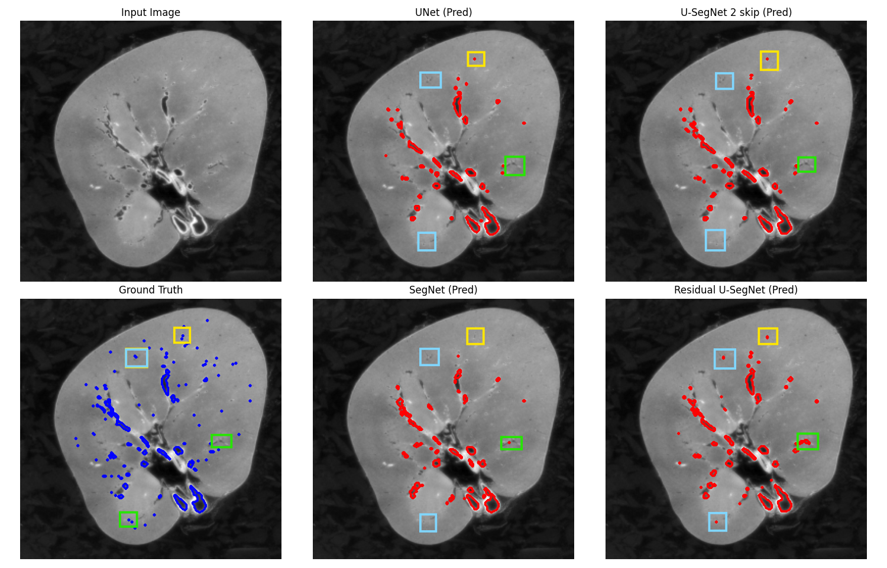

# Exploring U-SegNet and its variant for medical image segmentation

This repository contains the Python code for implementing U-SegNet variants. The original USegNet architecture was introduced in this article: 

> Pulkit Kumar, Pravin Nagar, Chetan Arora, Anubha Gupta.  
> ["U-SegNet: Fully Convolutional Neural Network Based Automated Brain Tissue Segmentation Tool"](https://arxiv.org/abs/1806.04429).  

It also implemented Unet, Residual Unet, SegNet. I also proposed a new variant: the Residual UsegNet. The goal was to compare the quantitative (dice score and accuracy score) and qualitative (visual segmentation) performance of the models relative to their number of parameter. To achieve this, we explored three variants of the U-SegNet architecture with 1,2 or 3 skip connections to find the best trade-off between model size and performance. UNet, SegNet and residual Unet served as baseline models for comparison.

<h4 style="text-align: center;" >
Original U-SegNet architecture proposed in the paper 
 

</h4>

## Repository Contents

- `models/`: Python code for the U-Net, Residual U-Net, SegNet, U-SegNet with 1, 2 and 3 skips, Residual U-SegNet
- `Results/`: containing the best models weights trained for the two datasets, and results visualization (segmentation and metrics)
- `utils/`: python code containing useful functions for preprocessing, training evaluation and visualization
- `kaggle_kidney_vessel_segmentation.ipynb`: Kaggle notebook for segmenting kidney vessels on this dataset **SenNet + HOA - Hacking the Human Vasculature in 3D**
- `kaggle_retina_vessel_usegnet.ipynb`: Kaggle notebook for segmenting retina blood vessel on this dataset **Retina Blood Vessel**

## Play with the code

You can easily test the code on kaggle using the two notebooks. All required functions already are in the notebook. No need to upload `utils`

1. Create a **Kaggle account**. Sign up for free at [kaggle.com](https://www.kaggle.com).
2. Access to the dataset **SenNet + HOA - Hacking the Human Vasculature in 3D**, which can be found [https://www.kaggle.com/competitions/blood-vessel-segmentation](https://www.kaggle.com/competitions/blood-vessel-segmentation).
3. Upload the `kaggle_kidney_vessel_segmentation.ipynb` and connect it to the previous dataset
4. [Optional] you can upload the trained model weights directly in kaggle (the notebook use this file with the path '/kaggle/input/retinausegnet/pytorch/default/1/')

5. Access to the Dataset **Retina Blood Vessel** which can be found [https://www.kaggle.com/datasets/abdallahwagih/retina-blood-vessel/data](https://www.kaggle.com/datasets/abdallahwagih/retina-blood-vessel/data).
6. Upload the `kagggle_retina_vessel_usegnet.ipynb` and connect it to the previous dataset
7. [Optional] you can upload the trained model weights directly in kaggle (the notebook use this file with the path '/kaggle/input/retinavesselmodels/pytorch/default/1/')

## Some Results
<h4 style="text-align: center;" >
Segmentation results over Retina Vessel dataset 
 

</h4>
<h4 style="text-align: center;" >
Segmentation results over Kidney Vessel dataset 
 

</h4>

### Models performances comparison on Retina Blood Vessel Dataset

| **Model**             | **Dice**  | **Accuracy**  | **Parameters**  |
|-----------------------|-----------|---------------|-----------------|
| U-Net (4 levels)      | **0.7856**| 0.9620        | 31,043,521      |
| Residual U-Net        | 0.7788    | 0.9631        | 13,043,009      |
| SegNet (5 levels)     | 0.6876    | 0.9580        | 29,443,585      |
| U-SegNet (3 skips)    | 0.7763    | 0.9631        | 4,247,809       |
| U-SegNet (2 skips)    | 0.7776    | **0.9640**    | 3,657,985       |
| U-SegNet (1 skip)     | 0.7752    | 0.9633        | 3,510,529       |
| Residual U-SegNet     | 0.7724    | 0.9576        | 8,126,665       |

